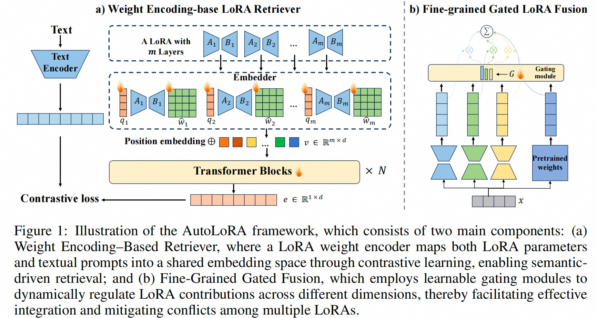
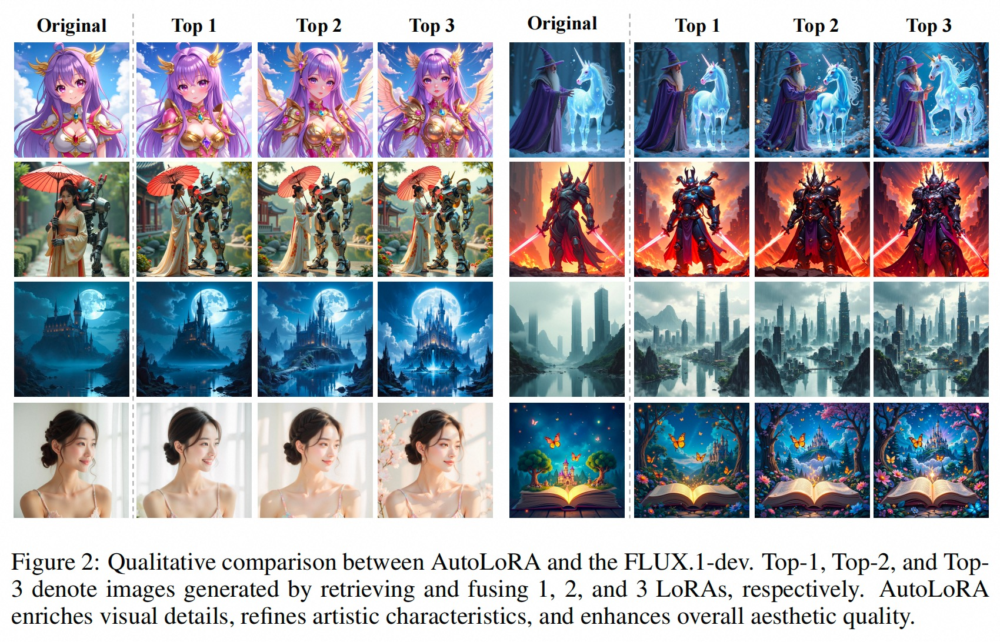
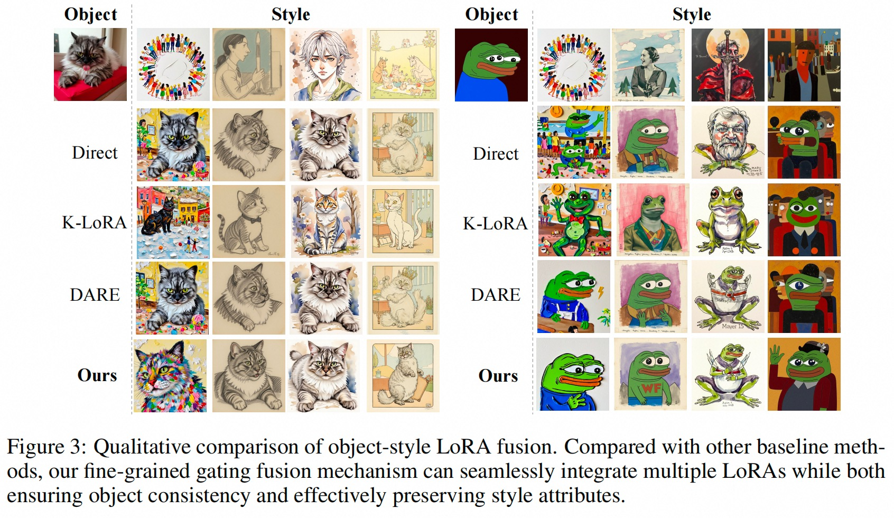
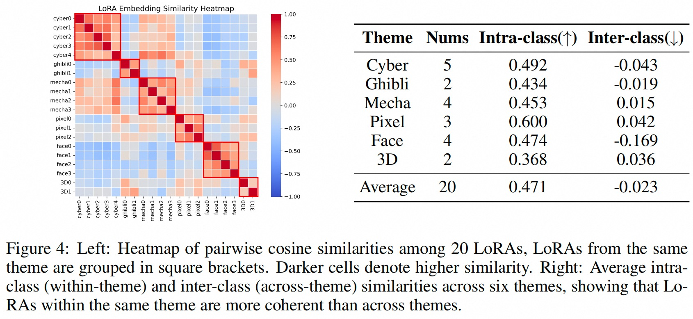

# AutoLoRA: Automatic LoRA Retrieval and Fine-Grained Gated Fusion for Text-to-Image Generation

Our code is built on [Diffsynth-Studio](https://github.com/modelscope/DiffSynth-Studio)

## Our Framework

## Main Results

## Use
training scripes: `train_retriever.py` and `train_merger.py`

test scripes: `test_retriever.py` and `test_merger.py`